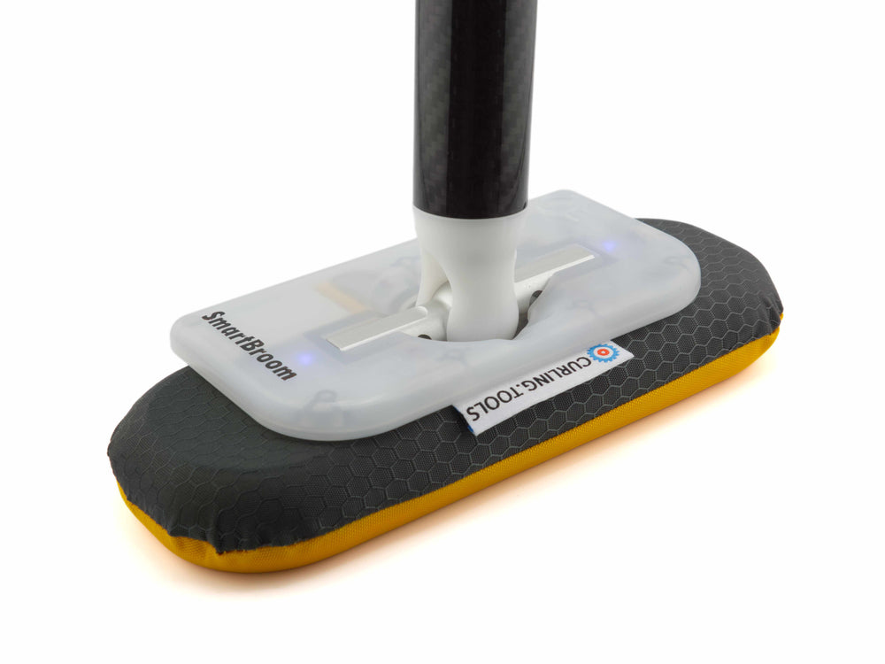

---
hide:
  - navigation
  - toc
  - path
  - footer
---

# Curling Tools User Guides { .guide-home__eyebrow }

Hardware, app, and troubleshooting help — all in one place. Choose your product to get started.

<a class="guide-product" href="smartbroom/" aria-labelledby="smartbroom-title">
  

    
  

  

    
PRODUCT GUIDE

    <h2 id="smartbroom-title">SmartBroom 4</h2>
    Explore the guide →
  

</a>

<a class="guide-product guide-product--beam" href="smartbeam/" aria-labelledby="smartbeam-title">
  

    
  

  

    
PRODUCT GUIDE

    <h2 id="smartbeam-title">SmartBeam</h2>
    Explore the guide →
  

</a>

## A little more help?

Find warranty, safety, and contact information in Support.

[Visit Support →](support/index.md){ .guide-home__support-link }

**A work in progress.** These guides currently contain placeholders. Verified product instructions will be added here.

[Back to curling.tools ↗](https://www.curling.tools/)

