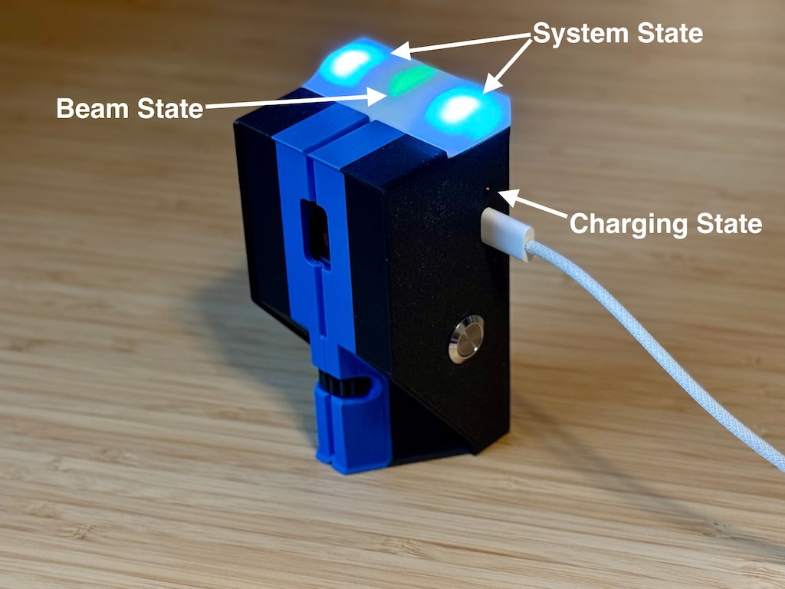

# LED Indication

SmartBeam uses separate LEDs for the beam itself, battery charging, and the timing system state.

## Where to look

- **Beam state:** an arrow-shaped LED pointing down the top of the unit, within the top light-bar.
- **System state:** LEDs at the two ends of the top light-bar.
- **Charging state:** an LED shining through a small hole on the side, directly above the USB port.

## Beam state LED

The arrow-shaped LED always indicates the state of that unit's beam.

| LED colour | Beam state |
| --- | --- |
| Red | Beam broken. |
| Green | Beam established. |

This is separate from the system state LEDs: the arrow shows the beam state, while the ends of the light-bar show connection and timing states.

## Charging state LED

The LED above the USB port indicates charging status whenever USB power is present. It remains illuminated while USB is powered, even if the SmartBeam unit is switched off.

| LED indication | Meaning |
| --- | --- |
| Off | USB is not powered. |
| Orange | Battery charging. |
| Green | Battery charging complete. |

## System state LEDs

The LEDs at the ends of the top light-bar indicate the following states.

### Connection and readiness

| LED indication | Meaning |
| --- | --- |
| Flashing white | Searching for a Bluetooth connection. |
| Solid white | Connected, but not included in the beam setup. |
| Solid orange | Active beam. |
| Solid blue | Idle and disarmed. |
| Solid purple | Idle and armed. |
| Solid teal | The system will arm when the beam is tripped. |

### Timing and countdowns

| LED indication | Meaning |
| --- | --- |
| Red | Beam broken during timing. |
| Green | Beam complete during timing. |
| Rapid orange flashes | Arming countdown. |
| Blue flashes for about five seconds | Paused countdown. |
| Brief rapid red flashes | Timing cancelled or timed out. |

### Identification and low battery

| LED indication | Meaning |
| --- | --- |
| Brief, rapid random-colour pattern | Identifying the device. |
| Red flashes before shutdown | Battery depleted; the unit is about to shut down. |

## Related topics

- [Arming and Timing](arming-and-timing.md)
- [Charging](charging.md)
- [Connecting](connecting-smartbeam.md)

