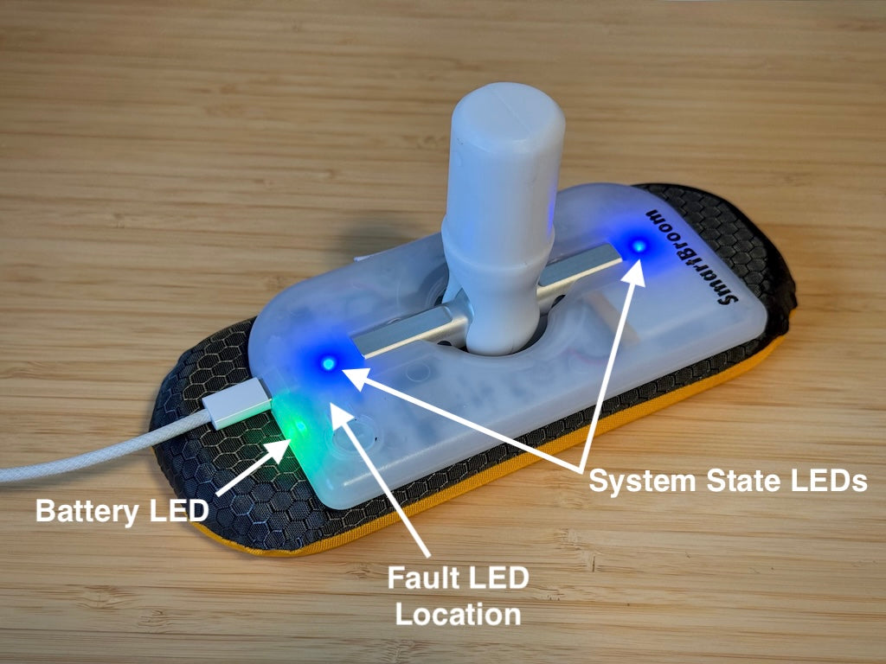

# SmartBroom 4 LED indicators

SmartBroom 4 has four LEDs beneath its translucent housing. They indicate battery, connection, data collection, and fault states.

## Where to look

- **System state:** two LEDs, one on each side of the main load bar.
- **Battery and charging:** one LED on the edge of the device, beside the USB port.
- **Fault:** one LED near the top of the button.

Read both the colour and the pattern. A solid light, a flashing light, and a gently breathing light can indicate different states.

## Battery LED

### Without USB power

When you turn on SmartBroom 4 without a USB cable connected, the battery LED briefly shows the battery's state of charge.

| Battery level | LED indication |
| --- | --- |
| 50–100% | Green |
| 20–49% | Orange |
| 0–19% | Red |

**Below 5%:** the battery LED flashes red continuously, rather than only showing a brief indication at startup.

### With USB power

When USB power is present, the same LED shows charging status. The charging thresholds differ from the startup battery indication above.

| Battery level | LED indication |
| --- | --- |
| 100% — fully charged | Solid green |
| 81–99% | Breathing green |
| 20–80% | Breathing orange |
| 0–19% | Breathing red |

## System state LEDs

These are the two LEDs on either side of the main load bar.

| LED indication | Meaning |
| --- | --- |
| Both solid blue | Ready to sweep, with background data collection enabled. |
| Flashing white | Not ready for background data collection; waiting for a Bluetooth connection. |
| Brief rainbow pattern | A Bluetooth connection has just been established. |
| Alternating purple and blue blend | An active Bluetooth connection. |
| Flashing blue | Actively broadcasting live data to a Bluetooth device. |

For normal background collection, turn on SmartBroom 4 and look for **two solid blue LEDs** before starting your game.

## Fault LED

The fault LED should not illuminate in normal use. If it flashes a white-and-red code, contact Curling Tools; the code can help diagnose the issue.

[Contact Curling Tools](https://curling.tools/pages/contact)

## Related topics

- [Background recording](background-recording.md)
- [Charging](charging.md)
- [Connecting SmartBroom](connecting-smartbroom.md)

Based on [SmartBroom 4 LED Indication](https://curling.tools/blogs/support-articles/smartbroom-4-led-indication) on the Curling Tools support blog.
